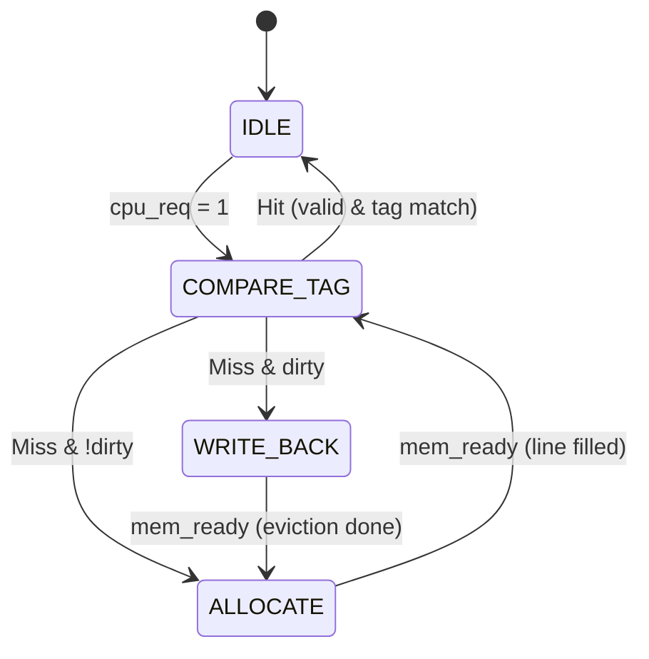
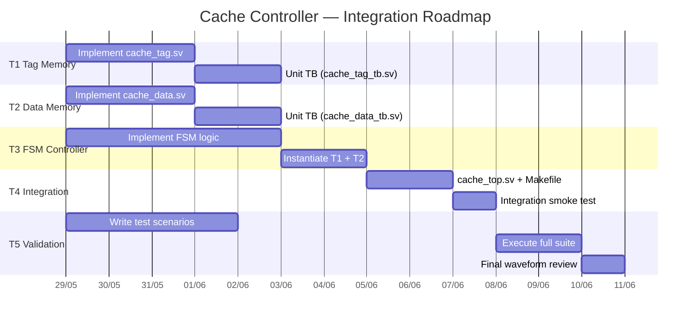

# Work Breakdown Structure — RISC-V Cache Controller

> **Methodology:** Spec-Driven Development (SDD)  
>
> **Reference:** Patterson & Hennessy, *Computer Organization and Design — RISC-V Edition*, Section 5.12  
>
> **Team:** Bruno · João Costa · João Pedro · Lucas · Pedro Henrique

---

## 0 — Architecture Overview & Conventions

### 0.1 Cache Geometry (Direct-Mapped, Write-Back)

| Parameter         | Value             | Derivation                         |
|:------------------|:------------------|:-----------------------------------|
| Cache Size        | 16 KB             | 1024 lines × 4 words × 4 bytes    |
| Line Size         | 4 words (16 B)    | `offset[3:2]` selects word         |
| Number of Lines   | 1024              | `index[13:4]` (10 bits)            |
| Tag Width         | 18 bits           | `addr[31:14]`                      |
| Data Word Width   | 32 bits           | RISC-V word                        |
| Write Policy      | Write-Back        | Dirty bit per line                 |
| Associativity     | 1 (direct-mapped) | —                                  |

### 0.2 Address Field Decomposition (32-bit)

```
 31              14 | 13          4 | 3    2 | 1  0
 ──────────────────┼──────────────┼────────┼──────
     TAG (18)      |  INDEX (10)  | OFFSET | BYTE
                   |              |  (2)   | (2)
```

### 0.3 FSM State Diagram (Section 5.12)



### 0.4 Repository File Mapping

| File                                  | Subtask | Description                          |
|:--------------------------------------|:-------:|:-------------------------------------|
| `src/cache_tag.sv`                    |   T1    | Tag + valid + dirty storage          |
| `src/cache_data.sv`                   |   T2    | Data word storage (4 words × 1024)   |
| `src/cache_controller.sv`             |   T3    | FSM + datapath wiring                |
| `src/cache_top.sv` **[NEW]**          |   T4    | Top-level integration wrapper        |
| `tb/mem_main_model.sv`                |   T4    | Main-memory model (exists)           |
| `tb/cache_tag_tb.sv` **[NEW]**        |   T1    | Unit testbench for tag memory        |
| `tb/cache_data_tb.sv` **[NEW]**       |   T2    | Unit testbench for data memory       |
| `tb/cache_controller_tb.sv`           |   T5    | System-level testbench (exists)      |
| `tb/cache_consistency_tb.sv` **[NEW]**|   T5    | Write-back consistency scenarios     |
| `sim/Makefile`                        |  T4/T5  | Build targets (update)               |

---

## T1 — Tag Memory Module (`cache_tag`)

**Assignee:** João Costa Calazans

**File:** [`src/cache_tag.sv`](file:///home/costa/workspace/courses/arq3/riscv-cache-controller/src/cache_tag.sv)  

**Unit TB:** `tb/cache_tag_tb.sv` [NEW]

### T1.1 — Specification

The Tag Memory stores the 18-bit tag, a **valid** bit, and a **dirty** bit for each of the 1024 cache lines. It supports synchronous writes and combinational reads to allow same-cycle hit detection.

### T1.2 — Interface Contract

```systemverilog
module cache_tag (
    input  logic        clk,
    input  logic        rst,

    // Lookup / Write Port
    input  logic [9:0]  index,       // Line index (addr[13:4])
    input  logic        we,          // Write-enable (set by FSM)
    input  logic [17:0] tag_in,      // Tag to be written
    input  logic        valid_in,    // Valid bit to be written
    input  logic        dirty_in,    // Dirty bit to be written

    // Read Port (combinational)
    output logic [17:0] tag_out,     // Stored tag at 'index'
    output logic        valid_out,   // Stored valid bit
    output logic        dirty_out    // Stored dirty bit
);
```

### T1.3 — Internal Design Requirements

| Requirement    | Detail                                                                     |
|:---------------|:---------------------------------------------------------------------------|
| Storage        | `logic [17:0] tag_array [0:1023]`                                          |
|                | `logic valid_array [0:1023]`                                               |
|                | `logic dirty_array [0:1023]`                                               |
| Reset          | On `rst`, all `valid_array` entries → `0` (cold start). Dirty bits → `0`. |
| Write          | Synchronous (`posedge clk`): if `we`, store `tag_in`, `valid_in`, `dirty_in` at `index`. |
| Read           | **Combinational** (async read): `tag_out`, `valid_out`, `dirty_out` reflect current `index` continuously. |

> **Rationale for combinational read:** The FSM in T3 needs hit/miss resolution within the same cycle it enters `COMPARE_TAG`.

### T1.4 — Validation Criteria (Unit Level)

Create `tb/cache_tag_tb.sv` with the following self-checking tests:

| Test ID | Scenario                    | Pass Condition                                              |
|:--------|:----------------------------|:------------------------------------------------------------|
| TT-01   | Cold reset                  | All 1024 `valid_out` read as `0`                            |
| TT-02   | Write then read (same idx)  | `tag_out`, `valid_out`, `dirty_out` match written values    |
| TT-03   | Overwrite at same index     | New values replace old; old values not visible              |
| TT-04   | Different indices isolation  | Write to index `A` does not corrupt index `B`               |
| TT-05   | Dirty bit toggle            | Write `dirty=1`, verify; write `dirty=0`, verify           |

### T1.5 — Deliverables Checklist

- [ ] Implement `cache_tag.sv` internal logic
- [ ] Create and pass `cache_tag_tb.sv` (all TT-01 through TT-05)
- [ ] Waveform screenshot in `doc/` confirming TT-02 timing

---

## T2 — Data Memory Module (`cache_data`)

**Assignee:** João Pedro Torres

**File:** [`src/cache_data.sv`](file:///home/costa/workspace/courses/arq3/riscv-cache-controller/src/cache_data.sv)  

**Unit TB:** `tb/cache_data_tb.sv` [NEW]

### T2.1 — Specification

The Data Memory stores 4 data words (32-bit each) per cache line, totaling 1024 lines × 4 words = 4096 words. It supports:
- **Word-level writes** (CPU write-hit via `offset` + `we`), and
- **Full-line writes** (block fill from main memory during Allocate, via `line_we` + `line_in`).

### T2.2 — Interface Contract

```systemverilog
module cache_data (
    input  logic          clk,

    // Word-Level Access (CPU read/write hit)
    input  logic [9:0]    index,       // Line index (addr[13:4])
    input  logic [1:0]    offset,      // Word select within line (addr[3:2])
    input  logic          we,          // Word write-enable
    input  logic [31:0]   data_in,     // Word to write

    output logic [31:0]   data_out,    // Word read at index+offset

    // Line-Level Access (Allocate fill / Write-Back eviction)
    input  logic          line_we,     // Full-line write-enable
    input  logic [127:0]  line_in,     // 4-word line input {w3, w2, w1, w0}

    output logic [127:0]  line_out     // 4-word line output (for Write-Back)
);
```

> **Key design note:** `line_we` and `we` are **mutually exclusive** — the FSM guarantees only one is asserted per cycle.

### T2.3 — Internal Design Requirements

| Requirement    | Detail                                                                  |
|:---------------|:------------------------------------------------------------------------|
| Storage        | `logic [31:0] data_array [0:1023][0:3]` (1024 lines × 4 words)         |
| Word Read      | **Combinational**: `data_out = data_array[index][offset]`               |
| Line Read      | **Combinational**: `line_out = {data_array[index][3], ..., data_array[index][0]}` |
| Word Write     | Synchronous: if `we`, `data_array[index][offset] <= data_in`           |
| Line Write     | Synchronous: if `line_we`, all 4 words written from `line_in`          |

### T2.4 — Validation Criteria (Unit Level)

Create `tb/cache_data_tb.sv` with the following self-checking tests:

| Test ID | Scenario                    | Pass Condition                                                   |
|:--------|:----------------------------|:-----------------------------------------------------------------|
| TD-01   | Word write + read           | `data_out` matches `data_in` at same `index`+`offset`           |
| TD-02   | Line write + word read      | Each of 4 offsets returns the correct word from `line_in`        |
| TD-03   | Line write + line read      | `line_out == line_in` (full 128-bit match)                       |
| TD-04   | Word write preserves line   | Write one word; other 3 words in same line remain untouched      |
| TD-05   | Cross-index isolation       | Write to line `X` does not corrupt line `Y`                      |

### T2.5 — Deliverables Checklist

- [ ] Implement `cache_data.sv` internal logic (including `line_we`/`line_in`/`line_out` ports)
- [ ] Create and pass `cache_data_tb.sv` (all TD-01 through TD-05)
- [ ] Waveform screenshot in `doc/` confirming TD-02 timing

---

## T3 — Cache Controller FSM (`cache_controller`)

**Assignee:** Pedro Henrique Debs Rabelo

**File:** [`src/cache_controller.sv`](file:///home/costa/workspace/courses/arq3/riscv-cache-controller/src/cache_controller.sv)

### T3.1 — Specification

The controller FSM orchestrates all cache operations. It receives CPU requests, performs tag comparison, and drives state transitions per Section 5.12. This is the most complex module — it **instantiates** `cache_tag` and `cache_data` internally, and exposes only the CPU-side and Memory-side interfaces.

### T3.2 — Interface Contract (existing — no changes)

```systemverilog
module cache_controller (
    input  logic        clk,
    input  logic        rst,

    // CPU Interface
    input  logic [31:0] cpu_addr,
    input  logic [31:0] cpu_wdata,
    input  logic        cpu_req,
    input  logic        cpu_write,     // 0 = Read, 1 = Write
    output logic [31:0] cpu_rdata,
    output logic        cpu_ready,     // Operation complete pulse

    // Main Memory Interface
    output logic [31:0] mem_addr,
    output logic [31:0] mem_wdata,
    output logic        mem_req,
    output logic        mem_write,
    input  logic [31:0] mem_rdata,
    input  logic        mem_ready
);
```

### T3.3 — FSM State Table

| State           | Entry Condition                         | Actions                                                                       | Next State                                |
|:----------------|:----------------------------------------|:------------------------------------------------------------------------------|:------------------------------------------|
| **IDLE**        | Default / after `cpu_ready` pulse       | `cpu_ready ← 0`; wait for `cpu_req`                                          | → `COMPARE_TAG` if `cpu_req`              |
| **COMPARE_TAG** | `cpu_req` received                      | Decompose addr → `tag`, `index`, `offset`; compare with `tag_out`            | → `IDLE` (hit); → `ALLOCATE` (miss+clean); → `WRITE_BACK` (miss+dirty) |
| **WRITE_BACK**  | Miss on dirty line                      | Send `line_out` word-by-word to memory (4 cycles); `mem_write ← 1`           | → `ALLOCATE` when last word ack'd         |
| **ALLOCATE**    | Miss on clean line / after write-back   | Read 4 words from memory to fill line; `mem_write ← 0`                       | → `COMPARE_TAG` when line fully received  |

### T3.4 — Detailed Control Signal Map

#### COMPARE_TAG — Hit Path
```
if (valid_out && tag_out == cpu_addr[31:14]):
    if (cpu_write):
        cache_data.we     ← 1
        cache_data.data_in← cpu_wdata
        cache_tag.we      ← 1         // set dirty
        cache_tag.dirty_in← 1
    else:
        cpu_rdata         ← cache_data.data_out
    cpu_ready             ← 1
    next_state             ← IDLE
```

#### COMPARE_TAG — Miss Path
```
if (!valid_out || tag_out != cpu_addr[31:14]):
    if (valid_out && dirty_out):
        next_state ← WRITE_BACK      // evict first
    else:
        next_state ← ALLOCATE         // clean miss
```

#### WRITE_BACK (word-by-word eviction, 4 beats)
```
mem_addr  ← {tag_out, index, word_counter, 2'b00}
mem_wdata ← line_out[ word_counter*32 +: 32 ]
mem_req   ← 1
mem_write ← 1
if (mem_ready): word_counter++
if (word_counter == 4): next_state ← ALLOCATE
```

#### ALLOCATE (word-by-word fill, 4 beats)
```
mem_addr  ← {cpu_addr[31:4], word_counter, 2'b00}
mem_req   ← 1
mem_write ← 0
if (mem_ready):
    fill_buffer[word_counter] ← mem_rdata
    word_counter++
if (word_counter == 4):
    cache_data.line_we  ← 1
    cache_data.line_in  ← fill_buffer
    cache_tag.we        ← 1
    cache_tag.tag_in    ← cpu_addr[31:14]
    cache_tag.valid_in  ← 1
    cache_tag.dirty_in  ← 0
    next_state          ← COMPARE_TAG   // re-compare for the hit
```

### T3.5 — Internal Module Instantiation

```systemverilog
// Inside cache_controller:
wire [17:0] tag_field   = cpu_addr[31:14];
wire [9:0]  index_field = cpu_addr[13:4];
wire [1:0]  offset_field= cpu_addr[3:2];

cache_tag u_tag (
    .clk(clk), .rst(rst),
    .index(index_field),
    .we(tag_we), .tag_in(tag_wr), .valid_in(valid_wr), .dirty_in(dirty_wr),
    .tag_out(tag_rd), .valid_out(valid_rd), .dirty_out(dirty_rd)
);

cache_data u_data (
    .clk(clk),
    .index(index_field), .offset(offset_field),
    .we(data_we), .data_in(data_wr), .data_out(data_rd),
    .line_we(line_we), .line_in(line_wr), .line_out(line_rd)
);
```

### T3.6 — Validation Criteria (FSM Level)

> **Note:** T3 testing can use an FSM-only testbench with **mock** tag/data modules OR wait for T1+T2 to be ready. The full system test is in T5.

| Test ID | Scenario                       | Pass Condition                                       |
|:--------|:-------------------------------|:-----------------------------------------------------|
| TF-01   | Read miss (cold cache)         | FSM enters ALLOCATE → returns to COMPARE_TAG → IDLE  |
| TF-02   | Read hit (after allocation)    | `cpu_ready` asserted in 1 cycle; correct `cpu_rdata`  |
| TF-03   | Write hit                      | `dirty` bit set; data updated in cache               |
| TF-04   | Write miss (clean)             | ALLOCATE → COMPARE_TAG → write hit path              |
| TF-05   | Write miss (dirty eviction)    | WRITE_BACK → ALLOCATE → COMPARE_TAG → write          |
| TF-06   | Back-to-back operations        | No FSM lockup; `cpu_ready` toggles correctly         |

### T3.7 — Deliverables Checklist

- [ ] Implement FSM (`typedef enum` for states, `always_ff` for transitions, `always_comb` for outputs)
- [ ] Instantiate `cache_tag` and `cache_data` internally
- [ ] Implement WRITE_BACK word-by-word eviction logic
- [ ] Implement ALLOCATE word-by-word fill logic with `fill_buffer`
- [ ] Pass all TF-01 through TF-06 (may depend on T1, T2 availability)

---

## T4 — Top-Level Integration & Memory Model (`cache_top`)

**Assignee:** Bruno Menezes Rodrigues Oliveira Vaz 

**Files:**

- `src/cache_top.sv` **[NEW]**
- [`tb/mem_main_model.sv`](file:///home/costa/workspace/courses/arq3/riscv-cache-controller/tb/mem_main_model.sv) (review/update)
- [`sim/Makefile`](file:///home/costa/workspace/courses/arq3/riscv-cache-controller/sim/Makefile) (update)

### T4.1 — Specification

This subtask creates the structural **top-level wrapper** (`cache_top`) that instantiates `cache_controller` and connects it to external CPU/Memory interfaces. It also reviews the existing `mem_main_model.sv` for correctness, adds burst-transfer support (4-beat), and updates the Makefile to include new files and test targets.

### T4.2 — `cache_top` Interface Contract

```systemverilog
module cache_top (
    input  logic        clk,
    input  logic        rst,

    // CPU Interface (directly exposed)
    input  logic [31:0] cpu_addr,
    input  logic [31:0] cpu_wdata,
    input  logic        cpu_req,
    input  logic        cpu_write,
    output logic [31:0] cpu_rdata,
    output logic        cpu_ready,

    // Main Memory Interface (directly exposed)
    output logic [31:0] mem_addr,
    output logic [31:0] mem_wdata,
    output logic        mem_req,
    output logic        mem_write,
    input  logic [31:0] mem_rdata,
    input  logic        mem_ready
);
    // Internal: instantiate cache_controller
    cache_controller u_ctrl ( .* );
endmodule
```

> **Design rationale:** `cache_top` exists to cleanly separate the integration boundary. If the design later evolves (e.g., adding L2 or set-associativity), only `cache_top` needs restructuring.

### T4.3 — Memory Model Review Checklist

| Item                      | Current Status         | Action Required                                      |
|:--------------------------|:-----------------------|:-----------------------------------------------------|
| Latency parameter         | ✅ `MEM_DELAY = 5`     | Keep as-is; validate with burst                      |
| Word-at-a-time transfers  | ✅ Single word          | Verify compatibility with T3 burst protocol          |
| Reset behavior            | ✅ Functional           | Confirm `mem_ready` deasserts properly after reset   |
| RAM pre-initialization    | ❌ Not initialized      | Add optional `$readmemh` for deterministic tests     |

### T4.4 — Makefile Updates

Add the following targets:

```makefile
# --- New Targets ---
test_tag:
	$(SIM_TOOL) -g2012 -o tag_test.out $(SRC_DIR)/cache_tag.sv $(TB_DIR)/cache_tag_tb.sv
	$(VVP) tag_test.out

test_data:
	$(SIM_TOOL) -g2012 -o data_test.out $(SRC_DIR)/cache_data.sv $(TB_DIR)/cache_data_tb.sv
	$(VVP) data_test.out

test_all: test_tag test_data run
```

### T4.5 — Validation Criteria (Integration Level)

| Test ID | Scenario                           | Pass Condition                                                |
|:--------|:-----------------------------------|:--------------------------------------------------------------|
| TI-01   | Compile all sources (zero errors)  | `iverilog -g2012` exits with code 0                           |
| TI-02   | Instantiation connectivity         | No unconnected port warnings                                  |
| TI-03   | Reset propagation                  | After reset, `cpu_ready = 0`, `mem_req = 0`, all valid = 0   |
| TI-04   | `mem_main_model` latency           | Response arrives exactly at `MEM_DELAY` cycles                |
| TI-05   | Full smoke test                    | Single read miss → allocate → read hit cycle works end-to-end |

### T4.6 — Deliverables Checklist

- [ ] Create `src/cache_top.sv`
- [ ] Review and update `tb/mem_main_model.sv` (add `$readmemh` option, verify burst compatibility)
- [ ] Update `sim/Makefile` with per-module test targets
- [ ] Pass TI-01 through TI-05

---

## T5 — System Validation & Testbenches

**Assignee:** _________________  

**Files:**

- [`tb/cache_controller_tb.sv`](file:///home/costa/workspace/courses/arq3/riscv-cache-controller/tb/cache_controller_tb.sv) (complete)
- `tb/cache_consistency_tb.sv` **[NEW]**

### T5.1 — Specification

This subtask develops the complete automated validation suite. Tests are organized into 4 categories covering all functional requirements. Each test prints **PASS/FAIL** to the console using `$display` assertions, enabling automated CI-style runs.

### T5.2 — Test Categories & Scenarios

#### Category A — Read Path

| Test ID | Scenario                         | Description                                                       | Pass Condition                    |
|:--------|:---------------------------------|:------------------------------------------------------------------|:----------------------------------|
| TS-A01  | Read miss (cold)                 | First access to address; cache is empty                           | Correct data from memory; `cpu_ready` asserted |
| TS-A02  | Read hit (warm)                  | Re-read same address after allocation                             | `cpu_ready` in 1 cycle; data matches           |
| TS-A03  | Sequential reads (same line)     | Read all 4 words at offsets `0,1,2,3` of a cached line            | All return correct data from cache              |
| TS-A04  | Read from multiple indices       | Read from indices `0, 1, 128, 255`                                | Each fills correctly and returns on re-read     |

#### Category B — Write Path

| Test ID | Scenario                         | Description                                                       | Pass Condition                    |
|:--------|:---------------------------------|:------------------------------------------------------------------|:----------------------------------|
| TS-B01  | Write miss (clean)               | Write to uncached address                                         | Allocate → write → dirty bit set  |
| TS-B02  | Write hit                        | Write to cached address                                           | Data updated; dirty bit set       |
| TS-B03  | Read after write (same addr)     | Write then read same word                                         | Read returns written value        |
| TS-B04  | Write to different offset        | Write to offset 2, verify offset 0 unchanged                     | No corruption within same line    |

#### Category C — Replacement & Write-Back

| Test ID | Scenario                         | Description                                                       | Pass Condition                    |
|:--------|:---------------------------------|:------------------------------------------------------------------|:----------------------------------|
| TS-C01  | Clean replacement                | Read addr A, then read addr B (same index, different tag)         | A evicted cleanly; B allocated    |
| TS-C02  | Dirty replacement (write-back)   | Write to addr A (dirty), then read addr B (same index)            | A written back to memory; B allocated |
| TS-C03  | Verify write-back data           | After TS-C02, read A from memory model                            | Memory contains A's written data  |
| TS-C04  | Multiple consecutive evictions   | Cycle through 3+ tags on same index                               | Each eviction+allocation correct  |

#### Category D — Edge Cases & Stress

| Test ID | Scenario                         | Description                                                       | Pass Condition                    |
|:--------|:---------------------------------|:------------------------------------------------------------------|:----------------------------------|
| TS-D01  | Back-to-back requests            | Issue CPU request immediately after `cpu_ready`                   | No FSM lockup; correct results    |
| TS-D02  | Reset mid-operation              | Assert `rst` during ALLOCATE state                                | FSM returns to IDLE; valid bits cleared |
| TS-D03  | Maximum index coverage           | Access indices `0` and `255`                                      | Boundary lines work correctly     |
| TS-D04  | All-zeros / all-ones addresses   | Addr `0x00000000` and `0xFFFFFFFF`                                | Correct field decomposition       |
| TS-D05  | Write then evict then re-read    | Write A → evict (read B same index) → read A again               | A re-fetched from memory with correct data |

### T5.3 — Self-Checking Testbench Pattern

```systemverilog
// Reusable assertion task for all tests
task automatic check(
    input string test_id,
    input logic [31:0] expected,
    input logic [31:0] actual
);
    if (actual !== expected) begin
        $display("[FAIL] %s: expected=0x%08h, got=0x%08h", test_id, expected, actual);
        fail_count++;
    end else begin
        $display("[PASS] %s", test_id);
        pass_count++;
    end
endtask

// Reusable CPU operation tasks
task automatic cpu_read(input logic [31:0] addr, output logic [31:0] data);
    @(posedge clk);
    cpu_addr  <= addr;
    cpu_req   <= 1;
    cpu_write <= 0;
    @(posedge clk);
    cpu_req   <= 0;
    wait (cpu_ready);
    data = cpu_rdata;
    @(posedge clk);
endtask

task automatic cpu_write_op(input logic [31:0] addr, input logic [31:0] data);
    @(posedge clk);
    cpu_addr  <= addr;
    cpu_wdata <= data;
    cpu_req   <= 1;
    cpu_write <= 1;
    @(posedge clk);
    cpu_req   <= 0;
    wait (cpu_ready);
    @(posedge clk);
endtask
```

### T5.4 — Final Report (Console Summary)

Each testbench must end with:

```systemverilog
$display("====================================");
$display("  RESULTS: %0d PASSED, %0d FAILED", pass_count, fail_count);
$display("====================================");
if (fail_count > 0) $fatal(1, "TEST SUITE FAILED");
```

### T5.5 — Validation Criteria (System Level)

| Test ID | Scope                 | Pass Condition                       |
|:--------|:----------------------|:-------------------------------------|
| TV-01   | All Category A tests  | 4/4 PASS                            |
| TV-02   | All Category B tests  | 4/4 PASS                            |
| TV-03   | All Category C tests  | 4/4 PASS                            |
| TV-04   | All Category D tests  | 5/5 PASS                            |
| TV-05   | VCD waveform review   | FSM transitions match state diagram  |

### T5.6 — Deliverables Checklist

- [ ] Complete `tb/cache_controller_tb.sv` with Categories A–D
- [ ] Create `tb/cache_consistency_tb.sv` for focused Category C testing
- [ ] Implement reusable `cpu_read` / `cpu_write_op` / `check` tasks
- [ ] All 17 tests PASS with zero failures
- [ ] Export representative VCD screenshots to `doc/`

---

## Integration Timeline & Dependencies



### Dependency Graph

```
T1 (Tag Memory) ──────┐
                       ├──→ T3 (FSM) ──→ T4 (Integration) ──→ T5 (System Test)
T2 (Data Memory) ─────┘                                          ↑
                                                                  │
T5 (Test Scenarios — can be written in parallel) ─────────────────┘
```

### Key Integration Rules

1. **Interface-first:** All port lists are frozen as defined in this document. Any change requires team consensus.
2. **Naming convention:** Signals use `snake_case`; modules use `snake_case`; test IDs follow the pattern `T[Category]-[Number]`.
3. **Commit convention:** Each subtask merges via Pull Request. Branch naming: `feat/T1-tag-memory`, `feat/T2-data-memory`, etc.
4. **Self-checking tests:** No test relies on manual waveform inspection for pass/fail. All print `[PASS]` / `[FAIL]` to console.
5. **Compilation gate:** No PR merges unless `make run` in `sim/` returns exit code 0.

---

## Team Assignment Summary

| Subtask | Scope                     | Primary Files                               | Est. Complexity |
|:--------|:--------------------------|:--------------------------------------------|:----------------|
| **T1**  | Tag Memory                | `cache_tag.sv`, `cache_tag_tb.sv`           | ★★☆☆☆           |
| **T2**  | Data Memory               | `cache_data.sv`, `cache_data_tb.sv`         | ★★☆☆☆           |
| **T3**  | FSM Controller            | `cache_controller.sv`                       | ★★★★★           |
| **T4**  | Integration & Build       | `cache_top.sv`, `mem_main_model.sv`, `Makefile` | ★★★☆☆        |
| **T5**  | System Validation         | `cache_controller_tb.sv`, `cache_consistency_tb.sv` | ★★★★☆      |

> **Balance note:** T1 and T2 are lower complexity but critical for correctness. Assignees can support T3 or T5 after completing their unit tests. T3 is the highest complexity and should go to the most experienced RTL designer.
